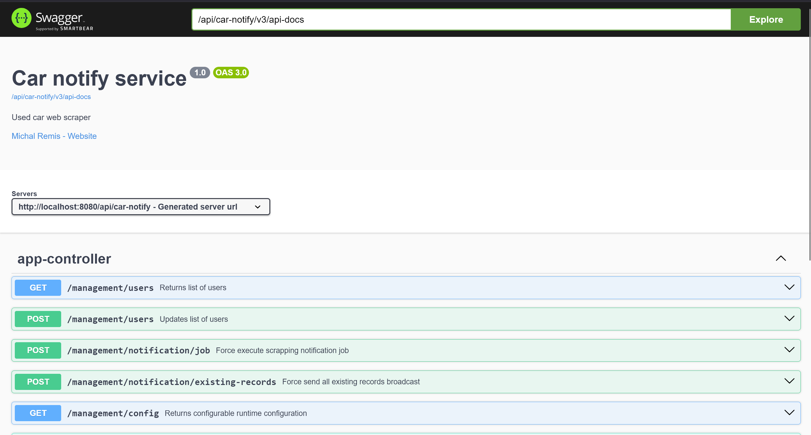

# 🚗 Used Car Notifier Bot

Watches [usedcars.toyota.sk](https://usedcars.toyota.sk) for new listings (e.g. **Corolla**, **RAV4**)  
and sends Telegram alerts with **photos** and **prices**.

Built with **Spring Boot 3.5.3** and **Java 21**.

---

## Features

-  Scrapes listings with `Jsoup`
-  In-memory storage backed by `users.json` and `cars.json`
-  Admin approval and user management
-  Per-user notification toggle
-  Configurable price threshold and car models
-  Sends Telegram photos + captions on new listings
- ️ Configurable via `application.yml`
-  No CLI needed – manage everything via **Telegram** and **Swagger UI**

---

## Architecture


---

## 🗂 JSON-Based Persistence

- On startup, the app loads `users.json` and `cars.json` into memory (if present, otherwise it creates new files automatically)
- Runtime operations work directly against in-memory maps
- After each change, the app **overwrites** the respective file
- This makes the app **stateless** and restart-friendly – no DB required

---

## 🔁 Background Job

A scheduled job (configurable) does all the heavy lifting:

1. Scrapes listings from the site using provided filters (e.g. model, price)
2. Compares against in-memory records to detect **new entries**
3. Filters for **approved** users with notifications enabled
4. Sends a **Telegram message** (caption + image) to each chat ID

---

## Quickstart

### Requirements

- Java 17 or newer
- Maven
- Telegram bot token
- Telegram bot username
- Admin Telegram chat ID (your own Telegram chat ID)

---

### 🛠 How to Run

### How to run

```bash
mkdir car-notifier
```

```bash
cd car-notifier
```

```bash
git clone https://github.com/m-remis/used-car-notify-bot.git
```

```bash
mvn clean install
```

```bash
java -DTELEGRAM_BOT_USERNAME={your_borName} -DTELEGRAM_BOT_TOKEN={your_bot_token} -DTELEGRAM_ADMIN_CHAT_ID={admin_chat_id} -jar target/car-notify-0.0.1.jar
```

Server will start on port 8080, Swagger-UI is accessible
from [here](http://localhost:8080/api/car-notify/swagger-ui/index.html)

<details>
  <summary>Instructions for Windows</summary>
    If you use Windows, you are dead to me, these steps are universal and you should have known
</details>



<h3 align="center">Demo</h3>

<p align="center">
  
</p>